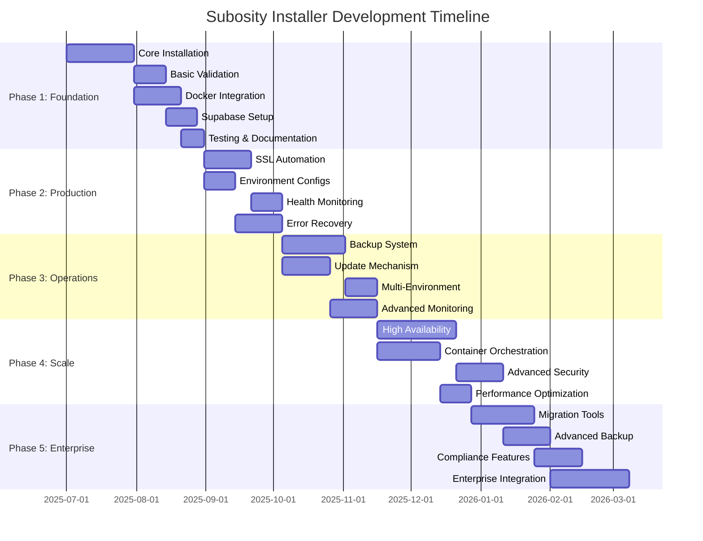

# 🗺️ Subosity Installer Roadmap

## Overview

This roadmap outlines the phased delivery strategy for the Subosity Installer, taking it from a functional MVP to a comprehensive enterprise-grade deployment solution. Each phase builds upon the previous one while delivering immediate value to users.

## 🎯 Release Philosophy

- **Ship Early, Ship Often**: Each phase delivers a complete, production-ready experience
- **Incremental Complexity**: Start simple, add sophistication progressively
- **User-Driven Priorities**: Features prioritized by real-world deployment needs
- **Enterprise Foundation**: Core architecture supports all future features from Phase 1

## 📊 Timeline Overview



## 🚀 Phase 1: Foundation (MVP) - "It Just Works"
**Duration**: ~6-8 weeks  
**Goal**: Single-command installation that reliably deploys Subosity

### Core Deliverables
- [x] **Container-First Architecture**: Thin binary + smart container pattern
- [x] **Basic Installation Flow**: `./subosity-install --domain=app.example.com --email=admin@example.com`
- [x] **Docker Integration**: Automatic Docker/Docker Compose installation
- [x] **Supabase Setup**: Orchestrate `supabase init` and `supabase start`
- [x] **Development SSL**: Self-signed certificates for local development
- [x] **Basic Validation**: System requirements and dependency checking
- [x] **Error Handling**: Clear error messages and basic recovery

### Success Criteria
```bash
# User can run this and get a working Subosity installation
curl -fsSL https://install.subosity.com | bash -s -- \
  --domain=myapp.local \
  --email=admin@example.com

# Result: Working Subosity instance accessible at https://myapp.local
```

### Technical Foundation
- Go binary for host-side operations (~5MB)
- Container with installation logic (subosity/installer:latest)
- Docker Compose for service orchestration
- Basic configuration validation
- Structured error reporting

---

## 🏗️ Phase 2: Production Ready - "Deploy with Confidence"
**Duration**: ~4-6 weeks  
**Goal**: Production-grade SSL, monitoring, and error recovery

### Core Deliverables
- [x] **Let's Encrypt Integration**: Automatic SSL certificate management
- [x] **Environment Configurations**: Dev/staging/production presets
- [x] **Health Monitoring**: Service health checks and status reporting
- [x] **Automatic Recovery**: Restart failed services, retry operations
- [x] **Configuration Validation**: Advanced validation with helpful suggestions
- [x] **Installation Modes**: Interactive, non-interactive, and config file modes

### Success Criteria
```bash
# Production deployment with real SSL
./subosity-install \
  --environment=production \
  --domain=app.company.com \
  --email=devops@company.com \
  --config=production.yaml

# Result: Production-ready instance with valid SSL, monitoring, auto-recovery
```

### New Capabilities
- Production SSL certificate automation
- Environment-specific security configurations
- Basic backup creation during installation
- Service dependency management
- Installation status dashboard

---

## 🔧 Phase 3: Operations - "Manage the Lifecycle"
**Duration**: ~6-8 weeks  
**Goal**: Complete lifecycle management with backup, updates, and monitoring

### Core Deliverables
- [x] **Backup & Restore System**: Automated backups with point-in-time recovery
- [x] **Update Mechanism**: Safe application and database updates
- [x] **Multi-Environment Support**: Manage dev/staging/prod environments
- [x] **Advanced Monitoring**: Metrics, logging, and alerting
- [x] **Configuration Management**: Runtime configuration updates
- [x] **Rollback Capabilities**: Automatic rollback on failed updates

### Success Criteria
```bash
# Backup and restore operations
subosity backup create --name="pre-deployment"
subosity restore --backup="pre-deployment"

# Safe updates with rollback
subosity update --version=1.2.0 --rollback-on-failure

# Multi-environment management
subosity env deploy staging --config=staging.yaml
subosity env promote staging production
```

### New Capabilities
- Automated backup scheduling
- Database migration management
- Component version management
- Advanced health monitoring
- Environment promotion workflows

---

## 📈 Phase 4: Scale - "Enterprise Ready"
**Duration**: ~8-10 weeks  
**Goal**: High availability, container orchestration, and advanced security

### Core Deliverables
- [x] **High Availability Setup**: Multi-node deployment with load balancing
- [x] **Kubernetes Support**: Helm charts and Kubernetes deployment options
- [x] **Advanced Security**: RBAC, audit logging, security scanning
- [x] **Performance Optimization**: Caching, CDN integration, scaling policies
- [x] **Container Registry**: Private registry support and image management
- [x] **Network Security**: VPN integration, firewall management

### Success Criteria
```bash
# High availability deployment
subosity deploy \
  --ha \
  --nodes=3 \
  --load-balancer=nginx \
  --database-replicas=2

# Kubernetes deployment
subosity deploy kubernetes \
  --namespace=subosity \
  --helm-values=production-values.yaml
```

### New Capabilities
- Multi-node HA deployments
- Kubernetes and Docker Swarm support
- Advanced security controls
- Performance monitoring and auto-scaling
- Enterprise authentication integration

---

## 🏢 Phase 5: Enterprise - "Mission Critical"
**Duration**: ~10-12 weeks  
**Goal**: Enterprise integration, compliance, and advanced operational features

### Core Deliverables
- [x] **Migration Tools**: Migrate from other platforms to Subosity
- [x] **Advanced Backup Features**: Cross-region backup, compliance retention
- [x] **Compliance Tools**: SOC2, GDPR, HIPAA compliance features
- [x] **Enterprise Integration**: LDAP/AD, SSO, enterprise monitoring systems
- [x] **Disaster Recovery**: Complete DR planning and automated failover
- [x] **Advanced Analytics**: Usage analytics, performance insights, capacity planning

### Success Criteria
```bash
# Enterprise migration
subosity migrate \
  --from=competitor \
  --data-path=/backup/competitor-export \
  --validation-mode=strict

# Compliance setup
subosity compliance enable \
  --standards=soc2,gdpr \
  --audit-retention=7years \
  --encryption=fips140-2
```

### New Capabilities
- Platform migration utilities
- Compliance automation
- Enterprise authentication
- Disaster recovery automation
- Advanced analytics and insights

---

## 🎯 Feature Priority Matrix

### Phase 1 (Must Have)
- ✅ Container architecture foundation
- ✅ Basic installation flow
- ✅ Docker integration
- ✅ Supabase orchestration
- ✅ Development SSL
- ✅ Error handling

### Phase 2 (Should Have)
- 🔄 Production SSL automation
- 🔄 Environment configurations
- 🔄 Health monitoring
- 🔄 Error recovery
- 🔄 Advanced validation

### Phase 3 (Nice to Have)
- ⏳ Backup & restore
- ⏳ Update mechanism
- ⏳ Multi-environment
- ⏳ Advanced monitoring

### Phase 4 (Future)
- 📋 High availability
- 📋 Kubernetes support
- 📋 Advanced security
- 📋 Performance optimization

### Phase 5 (Vision)
- 💭 Migration tools
- 💭 Compliance features
- 💭 Enterprise integration
- 💭 Disaster recovery

## 🔄 Continuous Improvements

Throughout all phases:
- **Documentation**: Keep README, PRD, and ARCHITECTURE up-to-date
- **Testing**: Maintain >90% code coverage
- **Security**: Regular security audits and dependency updates
- **Performance**: Continuous performance monitoring and optimization
- **Community**: Gather user feedback and iterate on features

## 📋 Success Metrics

### Phase 1 Metrics
- Installation success rate > 95%
- Average installation time < 10 minutes
- User satisfaction > 4.0/5.0

### Phase 2-3 Metrics
- Zero-downtime update success rate > 99%
- Backup/restore success rate > 99.9%
- Mean time to recovery < 5 minutes

### Phase 4-5 Metrics
- High availability uptime > 99.99%
- Enterprise feature adoption > 80%
- Compliance audit pass rate > 100%

---

## 🤝 Getting Involved

This roadmap is a living document. We welcome:
- **User Feedback**: What features matter most to your deployment?
- **Contributions**: Help us build the features you need
- **Testing**: Beta test new features and provide feedback
- **Documentation**: Improve our guides and documentation

---

*Last Updated: 2025-06-23*  
*Next Review: 2025-07-23*